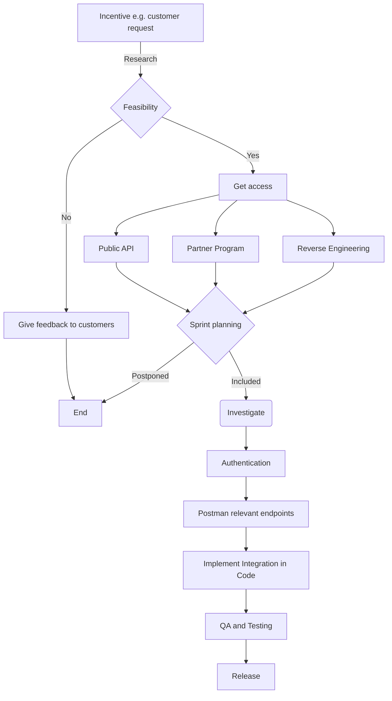

## References

*   [Entrypoint](entrypoint.i4d0v.sw.md)
    

This document describes how we can create an integration from scratch.

## Decision making process

<br/>

<!--MERMAID {width:100}-->

<!--MCONTENT {content: "graph TD<br/>\nA\\[Incentive e.g. customer request\\] \\-\\-\\>|Research| B{Feasibility}<br/>\nB \\-\\-\\> |No| C\\[Give feedback to customers\\]<br/>\nB \\-\\-\\> |Yes| D\\[Get access\\]<br/>\nC \\-\\-\\> Z\\[End\\]<br/>\nD \\-\\-\\> E\\[Public API\\] \\-\\-\\> H{Sprint planning}<br/>\nD \\-\\-\\> F\\[Partner Program\\] \\-\\-\\> H{Sprint planning}<br/>\nD \\-\\-\\> G\\[Reverse Engineering\\] \\-\\-\\> H{Sprint planning}<br/>\nH \\-\\-\\> |Postponed| Z\\[End\\]<br/>\nH \\-\\-\\> |Included| I(Investigate)<br/>\nI \\-\\-\\> J\\[Authentication\\] \\-\\-\\> K\\[Postman relevant endpoints\\] \\-\\-\\> L\\[Implement Integration in Code\\] \\-\\-\\> M\\[QA and Testing\\] \\-\\-\\> N\\[Release\\]<br/>\n<br/><br/><br/><br/>"} --->

<br/>

## How does this get implemented in code?

The code implementation for a new integration is fairly straightforward. All existing integrations are located in the `📄 src`directory. To create a new integration, simply copy the `📄 src` integration directory and replace all template names with the name of your integration.

<br/>

### The index file

<br/>

<br/>


<!-- NOTE-swimm-snippet: the lines below link your snippet to Swimm -->
### 📄 src/renderers.rs
```renderscript
18     
19     pub struct CameraRayRenderer<C: cameras::Camera, F: film::Film> {
20         camera: C,
21         film: F
22     }
23     
24     impl<C: cameras::Camera, F: film::Film> Renderer for CameraRayRenderer<C, F>{
25         fn render(&mut self){
26             for x in 0..configuration::width{
27                 for y in 0..configuration::height{
28                     let ray = self.camera.generate_ray(x as f64, y as f64, ((0.0,0.0),(0.0,0.0)));
29                     self.film.write_pixel(x, y, ray.0);
30                 }
31             }
32         }
33         fn prepare_render(&mut self){
34     
35         }
36         fn save_image(&self, path: &str){
37             return self.film.save_image(path);
38         }
39         fn evaluate(&mut self, t: f64){
40             self.camera.evaluate(t);
41             self.film.evaluate(t);
42         }
43     }
44     
45     impl<C: cameras::Camera, F: film::Film> CameraRayRenderer<C, F>{
46         pub fn new(camera: C, film: F) -> CameraRayRenderer<C, F>{
47             CameraRayRenderer{
48                 camera: camera,
49                 film: film
50             }
51         }
52     }
53     
```

<br/>

This file was generated by Swimm. [Click here to view it in the app](https://app.swimm.io/repos/Z2l0aHViJTNBJTNBUnVzdFJheU1hcmNoaW5nJTNBJTNBSmVyZW15RnVuaw==/docs/thsdx).
